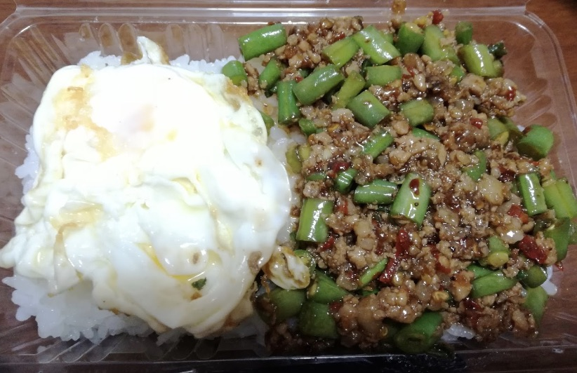

<html lang="ja">
 <head>
 <meta charset="UTF-8">
 <meta http-equiv="X-UA-Compatible" content="IE=EmulateIE10" />
 <title>再スタート</title>

<link href="https://cdnjs.cloudflare.com/ajax/libs/lightbox2/2.7.1/css/lightbox.css" rel="stylesheet">

</head>

<!--
<body onload="alert('長い間、お疲れ様でした！')" onunload="alert('再会の時まで、元気でお過ごしくださいませ〜(^o^)/')">-->

  モバイル端末をお使いの場合は、画面を横向きにすると
  より見やすくご覧頂けます。

	
<h1><marquee behavior="left">!!! ガイおべんとうのHPへようこそ !!!</marquee></h1>
                               

<h2>料理</h2>

<!--

-->

                              

<section>
<h2>気象庁、高解像度降水ナウキャスト</h2>
 <iframe src="https://www.jma.go.jp/jp/highresorad/" width="900" height="1500" frameborder="0" style="border:0" allowfullscreen></iframe>
       </section>
   
&#160;

       
&#160;

<main>
<!-- begin wwww.htmlcommentbox.com -->
 
<a href="http://www.htmlcommentbox.com">HTML Comment Box</a> is loading comments...

 <link rel="stylesheet" type="text/css" href="//www.htmlcommentbox.com/static/skins/bootstrap/twitter-bootstrap.css?v=0" />
 
<!-- end www.htmlcommentbox.com -->
</main>
       
       

&#160;

&#160;

&#160;

&#160;

&#160;

&#160;

&#160;

&#160;

&#160;

       
&#160;

&#160;

&#160;

&#160;

&#160;

&#160;

&#160;

&#160;

<!--      

<marquee direction="left" scrollamount="10" width="80%">背景は佐々木正美 送別会@なかはら、2011/01/14撮影 ~~~ (^^)/</marquee>
-->

 

<!-- フッタ -->
 <footer>
	Copyright 2020/07/17 peyng
 </footer>
